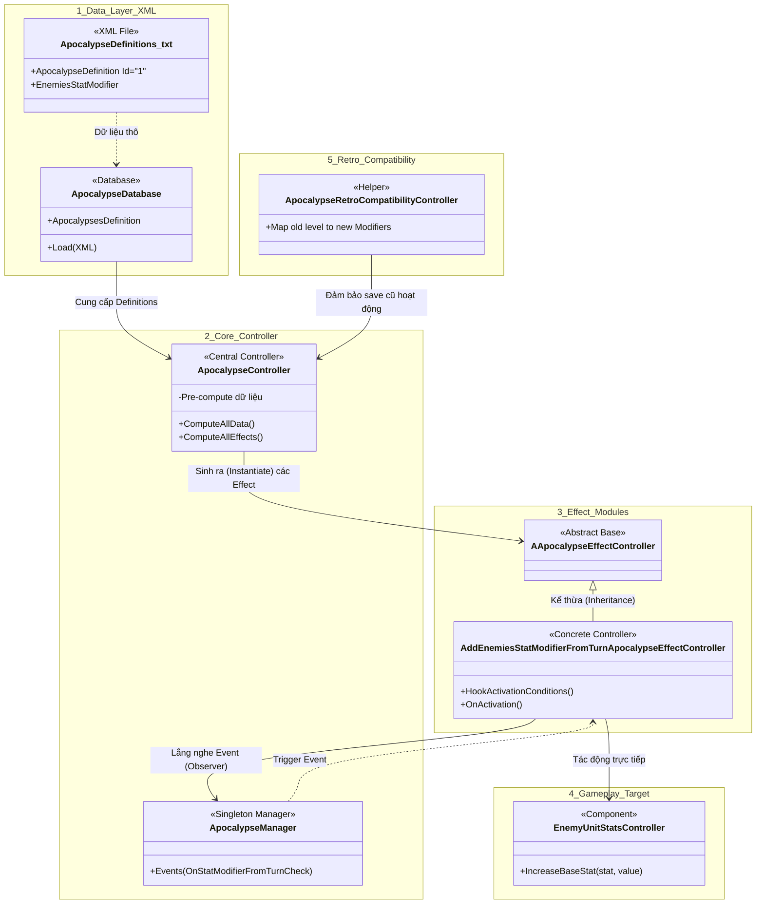

# Báo cáo Tổng hợp Hệ thống Apocalypse - The Last Stand

Tài liệu này tổng hợp toàn bộ quy trình hoạt động, cấu trúc mã nguồn, và kiến trúc thiết kế của hệ thống **Apocalypse (Chế độ tận thế / Độ khó tăng dần)** trong game. Hệ thống này được thiết kế cực kỳ bài bản theo mô hình **Data-Driven** kết hợp với **Event-Driven (Observer Pattern)**.

---

## 1. Tổng quan Hệ thống (Overview)

Apocalypse là hệ thống quản lý các hình phạt (Debuffs / Modifiers) áp dụng lên người chơi nhằm tăng độ khó của game. Thay vì hard-code các cấp độ khó trong mã nguồn, hệ thống này tách biệt hoàn toàn dữ liệu (Data) ra khỏi logic xử lý (Controllers).

**Đặc điểm nổi bật:**
*   Dễ dàng thêm/bớt độ khó bằng file Text (XML) mà không cần biên dịch lại game.
*   Cấu trúc rẽ nhánh (Modular) cho phép trộn lẫn nhiều hiệu ứng khác nhau.
*   Tối ưu hiệu năng bằng cách Pre-compute (Tính toán trước) tất cả các hình phạt ngay lúc nạp game.

---

## 2. Sơ đồ Kiến trúc Toàn cảnh (Architecture & Data Flow)

Sơ đồ dưới đây minh họa đường đi của dữ liệu từ khi nằm trên ổ cứng (XML) cho đến khi tác động trực tiếp vào máu của một con quái vật trong game.

---

## 3. Phân tích Chi tiết Từng Tầng (Layers)

### Tầng 1: Data & Database (XML to C# Objects)
Nguồn gốc của mọi hình phạt bắt đầu từ file `ApocalypseDefinitions.txt` nằm trong thư mục `TextAsset`. 
*   **Quá trình Parse:** `ApocalypseDatabase` sử dụng thư viện `System.Xml.Linq` (XDocument, XElement) để đọc nội dung file XML.
*   Nó bóc tách từng thẻ `<ApocalypseDefinition>` và `<Effects>` để tạo ra các class C# `Definition` tương ứng. Dữ liệu này chỉ mang tính chất chứa thông tin (Read-only), hoàn toàn không chứa Logic.

### Tầng 2: Quản lý Trung tâm (`TheLastStand.Controller.Apocalypse`)
Đây là khu vực chứa `ApocalypseController.cs`, đóng vai trò là "Bộ não".
*   **Nhiệm vụ chính:** Khi người chơi bắt đầu một vòng chơi mới (Run), Controller này sẽ quét xem người chơi đã chọn những Modifier nào. Nó sẽ gom chung tất cả `<Effects>` của các Modifier đó lại thành một cục lớn (`Apocalypse.AllEffects`).
*   **Tối ưu hiệu năng (Pre-compute):** Kế tiếp, nó gọi hàng loạt các hàm `Compute...()` (như `ComputeBuildingsDeadZoneRangeModifiers()`). Việc này nhằm phân loại và tổng hợp sẵn các thông số phạt (như vùng cấm xây nhà, chỉ số quái) vào các `Dictionary` để khi game chạy, nó chỉ việc tra cứu (O(1)) thay vì phải tính toán lại mỗi khung hình.

### Tầng 3: Xử lý Hiệu ứng chi tiết (`ApocalypseEffects` folder)
Nơi chứa các class xử lý Logic cho từng loại hiệu ứng riêng biệt.
*   **Design Pattern sử dụng:**
    *   **Strategy / Command Pattern:** Tất cả các hiệu ứng đều kế thừa từ class trừu tượng `AApocalypseEffectController`. Game chỉ việc gọi hàm `OnActivation()` mà không cần biết hiệu ứng bên trong là gì. Điều này giúp dễ dàng mở rộng thêm hàng trăm hiệu ứng mới mà không lo "phá" code cũ.
    *   **Observer Pattern (Event-driven):** Các class này giao tiếp với Game Loop thông qua sự kiện. Ví dụ: `AddEnemiesStatModifierFromTurnApocalypseEffectController` sẽ đăng ký (Hook) vào sự kiện của `ApocalypseManager`. Nó sẽ "ngủ đông" cho đến khi game chuyển sang Đêm (Night) tiếp theo thì mới thức dậy để kiểm tra điều kiện kích hoạt.

### Tầng 4: Tương tác với Gameplay (Direct Communication)
Khi một hiệu ứng trong Tầng 3 được kích hoạt, nó sẽ bắt đầu can thiệp vào game.
*   **Phương thức giao tiếp:** Hầu hết đều sử dụng mô hình **Singleton (`TPSingleton<T>`)** để lấy danh sách Entity toàn cục.
*   **Ví dụ:** Để buff máu cho toàn bộ quái vật, nó gọi `TPSingleton<EnemyUnitManager>.Instance.EnemyUnits` để lấy danh sách hàng ngàn con quái, sau đó chạy vòng lặp `foreach` chọc thẳng vào `EnemyUnitStatsController` của từng con để cộng dồn chỉ số (`stat.Apocalypse += Value`). Việc gọi hàm trực tiếp (Direct Call) này giúp tối ưu tốc độ xử lý khi phải thao tác với số lượng lớn object.

### Tầng 5: Tương thích ngược (`ApocalypseRetroCompatibilityController`)
*   **Lý do tồn tại:** Trong quá trình phát triển (có thể là đợt Early Access), hệ thống Apocalypse cũ chỉ là các cấp độ (Level 1, 2, 3...) cố định. Hệ thống mới (hiện tại) được làm lại theo dạng Modular (người chơi tự chọn hiệu ứng rời rạc).
*   **Chức năng:** Đoạn script này đóng vai trò như một **Adapter**. Khi load một file save cũ báo là "Level 4", nó sẽ tự động quy đổi (Map) thành các Modifiers tương ứng của hệ thống mới (VD: `ProductionCostModifier` và `DefenseCostModifier`) để game không bị sập (crash) và người chơi cũ không bị mất tiến trình.

---

> [!TIP]
> **Kết luận:**
> Cụm `TheLastStand.Controller.Apocalypse` là một minh chứng xuất sắc cho việc thiết kế kiến trúc game theo chuẩn **SOLID**. Nó tách biệt hoàn toàn Dữ liệu (Data), Quản lý tổng (Manager), và Logic chi tiết (Strategies), kết nối chúng bằng Events để đảm bảo tính mềm dẻo, dễ mở rộng và dễ bảo trì.
