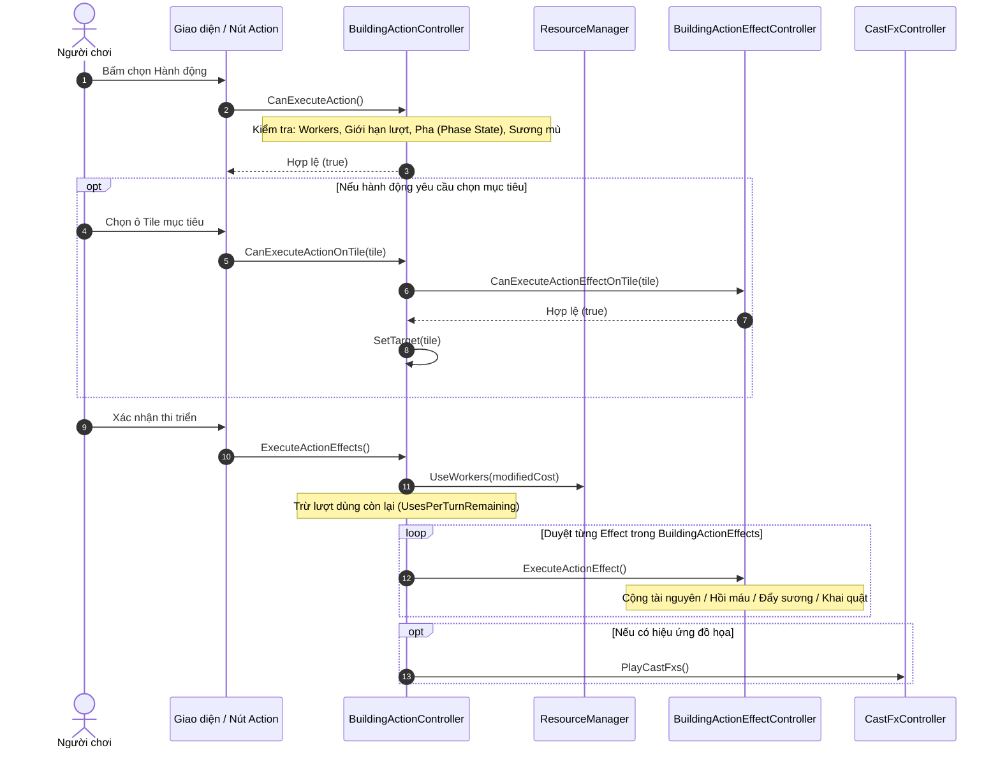

# Phân tích kiến trúc `TheLastStand.Controller.Building.BuildingAction`

Thư mục `TheLastStand.Controller.Building.BuildingAction` chịu trách nhiệm quản lý và điều phối các **Hành động chủ động (Building Actions)** mà người chơi có thể ra lệnh cho công trình thực hiện (tiêu hao Công nhân / Workers hoặc lượt dùng trong ngày).

> [!NOTE]
> **Hệ thống hướng dữ liệu (Data-Driven Architecture)**
> Các hành động của công trình được tải từ cấu hình XML/Text:
> - [`BuildingActionDefinitions.txt`](file:///c:/Users/Admin/Desktop/ProjectGithub/TheLastSpell/TextAsset/BuildingActionDefinitions.txt)
> - [`BuildingDefinitions.txt`](file:///c:/Users/Admin/Desktop/ProjectGithub/TheLastSpell/TextAsset/BuildingDefinitions.txt)

---

## 1. Danh sách toàn bộ các Controller trong thư mục (13 files)

| File | Kiểu | Mô tả chức năng |
| :--- | :--- | :--- |
| [`BuildingActionController.cs`](file:///c:/Users/Admin/Desktop/ProjectGithub/TheLastSpell/TheLastStand.Controller.Building.BuildingAction/BuildingActionController.cs) | Controller chính | Quản lý vòng đời, điều kiện thi triển, trừ Workers, chạy các hiệu ứng con và kích hoạt Cast FX. |
| [`BuildingActionEffectController.cs`](file:///c:/Users/Admin/Desktop/ProjectGithub/TheLastSpell/TheLastStand.Controller.Building.BuildingAction/BuildingActionEffectController.cs) | Lớp cơ sở (Abstract) | Base controller định nghĩa `CanExecuteActionEffectOnTile(Tile)` và `ExecuteActionEffect()`. |
| [`BuildingActionExecutionController.cs`](file:///c:/Users/Admin/Desktop/ProjectGithub/TheLastSpell/TheLastStand.Controller.Building.BuildingAction/BuildingActionExecutionController.cs) | Controller phiên chạy | Quản lý model phiên thực thi hành động (`BuildingActionExecution`). |
| [`FillGaugeBuildingActionEffectController.cs`](file:///c:/Users/Admin/Desktop/ProjectGithub/TheLastSpell/TheLastStand.Controller.Building.BuildingAction/FillGaugeBuildingActionEffectController.cs) | Effect Controller | Nạp trực tiếp điểm sản xuất (`Production Units`) vào thanh tiến độ công trình. |
| [`GainGoldBuildingActionEffectController.cs`](file:///c:/Users/Admin/Desktop/ProjectGithub/TheLastSpell/TheLastStand.Controller.Building.BuildingAction/GainGoldBuildingActionEffectController.cs) | Effect Controller | Cộng Vàng vào kho tài nguyên tổng và hiện animation nổi `GainGoldDisplay`. |
| [`GainMaterialsBuildingActionEffectController.cs`](file:///c:/Users/Admin/Desktop/ProjectGithub/TheLastSpell/TheLastStand.Controller.Building.BuildingAction/GainMaterialsBuildingActionEffectController.cs) | Effect Controller | Cộng Vật liệu vào kho tài nguyên và hiện animation nổi `GainMaterialDisplay`. |
| [`HealBuildingActionEffectController.cs`](file:///c:/Users/Admin/Desktop/ProjectGithub/TheLastSpell/TheLastStand.Controller.Building.BuildingAction/HealBuildingActionEffectController.cs) | Effect Controller | Hồi máu cho 1 Hero hoặc toàn bộ đội hình, cập nhật mốc thương tật (`InjuryStage`). |
| [`HealManaBuildingActionEffectController.cs`](file:///c:/Users/Admin/Desktop/ProjectGithub/TheLastSpell/TheLastStand.Controller.Building.BuildingAction/HealManaBuildingActionEffectController.cs) | Effect Controller | Hồi Mana cho Hero đơn lẻ hoặc toàn đội, làm mới thanh hiển thị trên portrait panel. |
| [`RepelFogBuildingActionEffectController.cs`](file:///c:/Users/Admin/Desktop/ProjectGithub/TheLastSpell/TheLastStand.Controller.Building.BuildingAction/RepelFogBuildingActionEffectController.cs) | Effect Controller | Tạm khóa camera, lia máy quay tới rìa sương mù, đẩy lùi sương mù (`DecreaseDensity`). |
| [`RerollWaveBuildingActionEffectController.cs`](file:///c:/Users/Admin/Desktop/ProjectGithub/TheLastSpell/TheLastStand.Controller.Building.BuildingAction/RerollWaveBuildingActionEffectController.cs) | Effect Controller | Tạo ngẫu nhiên lại hướng và thành phần đợt tấn công quái của đêm tới. |
| [`RevealDangerIndicatorsBuildingActionEffectController.cs`](file:///c:/Users/Admin/Desktop/ProjectGithub/TheLastSpell/TheLastStand.Controller.Building.BuildingAction/RevealDangerIndicatorsBuildingActionEffectController.cs) | Effect Controller | Bật hiển thị chi tiết các mũi tên cảnh báo mức độ nguy hiểm và quân số địch. |
| [`ScavengeBuildingActionEffectController.cs`](file:///c:/Users/Admin/Desktop/ProjectGithub/TheLastSpell/TheLastStand.Controller.Building.BuildingAction/ScavengeBuildingActionEffectController.cs) | Effect Controller | Khai quật tàn tích / xác quái: trừ máu tàn tích, thu Vàng, Vật liệu, Damned Souls và rơi trang bị. |
| [`UpgradeStatBuildingActionEffectController.cs`](file:///c:/Users/Admin/Desktop/ProjectGithub/TheLastSpell/TheLastStand.Controller.Building.BuildingAction/UpgradeStatBuildingActionEffectController.cs) | Effect Controller | Tăng hoặc giảm trực tiếp chỉ số cơ bản (`BaseStat`) của Hero đơn lẻ hoặc toàn đội hình. |

---

## 2. Luồng thực thi chi tiết của `BuildingActionController`

---

## 3. Các Design Pattern được áp dụng

1. **Factory Pattern (`GenerateActionEffects`)**:
   - `BuildingActionController` đọc từng `BuildingActionEffectDefinition` và khởi tạo đúng loại Controller tương ứng (`FillGauge`, `Heal`, `GainGold`, `Scavenge`, ...).
2. **Composite Pattern**:
   - Một hành động (`BuildingAction`) có thể chứa danh sách nhiều hiệu ứng con (`List<BuildingActionEffect>`), cho phép kết hợp đa hiệu ứng trong cùng một lần click (ví dụ: vừa hồi máu vừa tăng stat).
3. **Command Pattern**:
   - Đóng gói toàn bộ thao tác kiểm tra tính khả thi (`CanExecuteAction`, `CanExecuteActionOnTile`) và hành động thực thi (`ExecuteActionEffects`) vào đối tượng độc lập.
4. **Strategy / Polymorphism**:
   - Lớp trừu tượng [`BuildingActionEffectController`](file:///c:/Users/Admin/Desktop/ProjectGithub/TheLastSpell/TheLastStand.Controller.Building.BuildingAction/BuildingActionEffectController.cs) định nghĩa giao diện chung cho phép thêm mới bất kỳ loại hiệu ứng công trình nào mà không làm ảnh hưởng đến mã nguồn quản lý chung.
