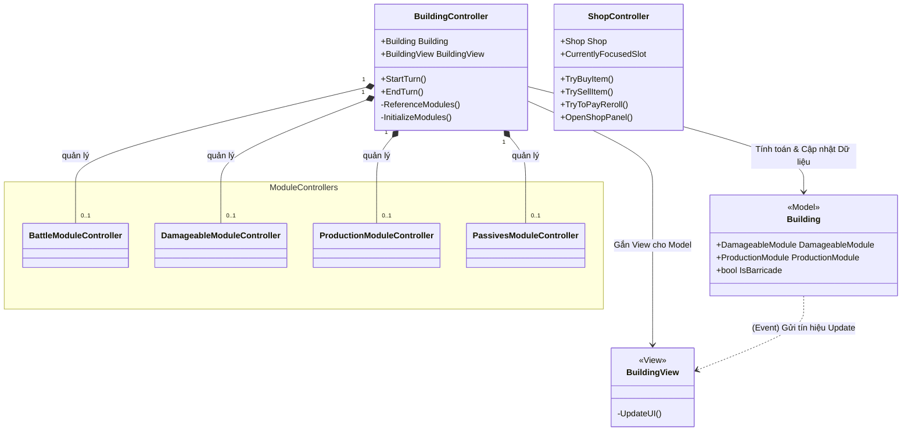

# Phân tích thư mục `TheLastStand.Controller.Building`

Thư mục `TheLastStand.Controller.Building` đóng vai trò là tầng **Controller** trong kiến trúc của game The Last Spell, chịu trách nhiệm quản lý logic và vòng đời của các tòa nhà (Building). 

## 1. Thành phần cốt lõi và Biến/Method

### 1.1 `BuildingController` (Trung tâm điều phối)
Lớp này nằm tại file: [`BuildingController.cs`](file:///c:/Users/Admin/Desktop/ProjectGithub/TheLastSpell/TheLastStand.Controller.Building/BuildingController.cs)
Đây là vỏ bọc đại diện cho 1 công trình trên bản đồ. Nó đóng vai trò là Façade, tiếp nhận các lệnh từ hệ thống và phân phối xuống các "bộ phận" (Modules) của tòa nhà.

**Các biến (Properties) chính:**
- `Building` (Model): Lưu trữ con trỏ tới lớp Model (chứa máu, tọa độ, thuộc tính). Xem class [`Building`](file:///c:/Users/Admin/Desktop/ProjectGithub/TheLastSpell/TheLastStand.Model.Building/Building.cs).
- `BuildingView` (View): Lấy view tương ứng từ Model để dễ truy xuất.
- `BlueprintModuleController`, `ProductionModuleController`, `DamageableModuleController`, v.v...: Các biến lưu trữ con trỏ tới các module con. Nhờ có các biến này, `BuildingController` biết công trình này có tính năng gì (sản xuất, đánh quái hay phòng thủ).

**Các hàm (Methods) chính:**
- `Constructor`: Có 2 constructor, một để tạo nhà mới hoàn toàn, và một nhận `SerializedBuilding` để phục hồi nhà từ file Save (tải game).
- `ReferenceModules()`: Hàm này chạy khi khởi tạo, giúp `BuildingController` "móc nối" (reference) tới các Module Controller từ Model. Nếu Model có `DamageableModule`, Controller sẽ lưu reference tới `DamageableModuleController`.
- `InitializeModules()` / `DeserializeModules()`: Khởi tạo dữ liệu mới hoặc nạp dữ liệu cũ (lúc load game) cho các module con.
- `StartTurn()`: Được gọi khi bắt đầu Turn mới (Sáng hoặc Đêm). Nó tuần tự gọi `StartTurn()` của các module tương ứng.
- `EndTurn()`: Báo hiệu kết thúc Turn.

### 1.2 `ShopController` (Quản lý Cửa Hàng)
Lớp này nằm tại file: [`ShopController.cs`](file:///c:/Users/Admin/Desktop/ProjectGithub/TheLastSpell/TheLastStand.Controller.Building/ShopController.cs)
Xử lý toàn bộ logic riêng cho cửa hàng (Shop).

**Các biến (Properties) chính:**
- `Shop` (Model): Chứa dữ liệu của cửa hàng.
- `CurrentlyFocusedInventorySlot` & `CurrentlyFocusedSlot`: Biến tạm lưu trữ con trỏ xem người chơi đang focus vào vật phẩm nào.

**Các hàm (Methods) chính:**
- `OpenShopPanel()` / `CloseShopPanel()`: Mở/đóng giao diện.
- `TryBuyItem()`: Kiểm tra vàng/hòm đồ, trừ vàng, chuyển Item.
- `TrySellItem()`: Nhận lại item, cộng vàng, trả Item lại Shop.
- `TryToPayReroll()`: Reroll cửa hàng.
- `ChangeUnitToCompareAndResetDropdown()`: Đổi mục tiêu Hero để so sánh chỉ số trang bị.

### 1.3 `Module Controllers`
Thư mục con `Module/` chứa các Controller chịu trách nhiệm cho tính năng chuyên biệt, ví dụ:
- `DamageableModuleController`: Nhận sát thương, hiển thị vỡ gạch.
- `ProductionModuleController`: Sinh tài nguyên/vật phẩm (`CreateActions()`, `StartTurn()`).
- `BattleModuleController`: Xử lý công trình tấn công quái vật.

## 2. Design Pattern & Kiến trúc sử dụng
Hệ thống Building trong The Last Spell tránh dùng kế thừa sâu (Inheritance) mà sử dụng mạnh mẽ **Component-Based Architecture** (tương tự ECS) và **Façade Pattern**:
- Thay vì tạo lớp `WallBuilding`, `ShopBuilding`, `TowerBuilding` kế thừa từ `Building`, hệ thống chỉ có một lớp `Building` duy nhất (xem tại [`Building.cs`](file:///c:/Users/Admin/Desktop/ProjectGithub/TheLastSpell/TheLastStand.Model.Building/Building.cs)).
- Lớp `Building` (Model) này chứa các module độc lập như `ConstructionModule`, `DamageableModule`, `ProductionModule`... Nếu công trình không thể bị tấn công, `DamageableModule` sẽ bằng `null`.
- `BuildingController` cũng chứa các `ModuleController` tương ứng. Điều này mang lại sự linh hoạt tuyệt đối: để tạo ra một cái chòi canh vừa có thể bắn quái, vừa sản xuất ra vàng, thiết kế game chỉ cần ghép `BattleModule` và `ProductionModule` vào chung một cấu hình tòa nhà.
- Các thuộc tính kiểm tra loại tòa nhà được thực hiện qua các bit-flag danh mục (Category) như `IsBarricade => Category.HasFlag(...)` thay vì dùng toán tử `is` hoặc `as` để ép kiểu.

## 3. Giao tiếp Script (Script Communication)
Áp dụng **MVC (Model - View - Controller)**:
- **Game Loop -> Controller**: Các hệ thống quản lý tổng (`BuildingManager`, `GameManager`) sẽ gọi `StartTurn()`, `EndTurn()` trên `BuildingController`.
- **Controller -> Model**: `BuildingController` (và các Module Controller của nó) chứa logic, tính toán các thay đổi và cập nhật trực tiếp vào dữ liệu trong các class thuộc `TheLastStand.Model.Building`.
- **Model -> View**: Model kích hoạt (fire) các sự kiện (Events/Action/Observer) khi dữ liệu bên trong thay đổi. `BuildingView` (và các View con) đăng ký lắng nghe các sự kiện này để tự động phát animation, hiện VFX cháy nổ tương ứng, đảm bảo UI luôn đồng bộ với dữ liệu.

## 4. Sơ đồ minh họa kiến trúc (Architecture Diagram)

