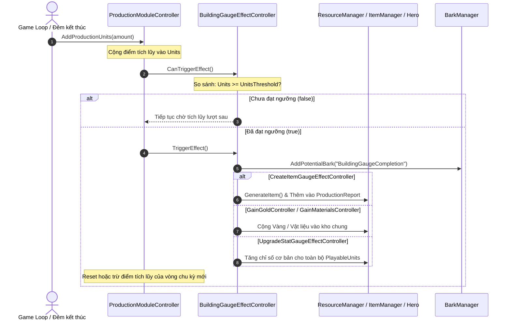

# Phân tích kiến trúc `TheLastStand.Controller.Building.BuildingGaugeEffect`

Thư mục `TheLastStand.Controller.Building.BuildingGaugeEffect` quản lý hệ thống **Thanh Tiến Trình Sản Xuất (Production Gauge)** của các công trình trong *The Last Spell*.

Khác với `BuildingAction` (hành động người chơi phải bấm nút thủ công), hệ thống **Gauge** hoạt động theo cơ chế **tích lũy chu kỳ tự động**: Mỗi đêm sống sót hoặc qua hành động nạp điểm, công trình sẽ nhận được các điểm sản xuất (`Production Units`). Khi tích đủ điểm đạt mốc ngưỡng (`Units >= UnitsThreshold`), công trình sẽ tự động phát phần thưởng (Vàng, Vật liệu, Trang bị, nâng cấp chỉ số Hero, v.v.).

> [!NOTE]
> **Data Driven (Kiến trúc hướng dữ liệu)**
> Mọi thông số ngưỡng điểm, lượng tài nguyên và danh mục trang bị sản xuất đều được nạp từ cấu hình text:
> - [`BuildingGaugeEffectDefinitions.txt`](file:///c:/Users/Admin/Desktop/ProjectGithub/TheLastSpell/TextAsset/BuildingGaugeEffectDefinitions.txt)
> - [`BuildingDefinitions.txt`](file:///c:/Users/Admin/Desktop/ProjectGithub/TheLastSpell/TextAsset/BuildingDefinitions.txt)

---

## 1. Danh sách toàn bộ các Controller trong thư mục (6 files)

| STT | File Controller | Vai trò & Logic thực thi chính |
| :---: | :--- | :--- |
| 1 | [`BuildingGaugeEffectController.cs`](file:///c:/Users/Admin/Desktop/ProjectGithub/TheLastSpell/TheLastStand.Controller.Building.BuildingGaugeEffect/BuildingGaugeEffectController.cs) | **Lớp cơ sở trừu tượng (Base Controller):** Quản lý model `BuildingGaugeEffect`, cung cấp `CanTriggerEffect()` (`Units >= UnitsThreshold`) và `TriggerEffect()` hiển thị câu thoại Bark hoàn thành. |
| 2 | [`CreateItemGaugeEffectController.cs`](file:///c:/Users/Admin/Desktop/ProjectGithub/TheLastSpell/TheLastStand.Controller.Building.BuildingGaugeEffect/CreateItemGaugeEffectController.cs) | **Chế tạo Trang bị / Vật phẩm:** Sinh trang bị thưởng theo cây xác suất cấp độ (`GenerationProbabilitiesTree`), hiển thị `CreateItemDisplay` và ghi nhận vào `ProductionReport` buổi sáng. |
| 3 | [`GainGoldController.cs`](file:///c:/Users/Admin/Desktop/ProjectGithub/TheLastSpell/TheLastStand.Controller.Building.BuildingGaugeEffect/GainGoldController.cs) | **Sản xuất Vàng:** Tính toán lượng vàng (`ComputeGoldValue`), ghi nhận Analytics, cộng vào `ResourceManager.Gold` và hiển thị animation `GainGoldDisplay`. |
| 4 | [`GainMaterialsController.cs`](file:///c:/Users/Admin/Desktop/ProjectGithub/TheLastSpell/TheLastStand.Controller.Building.BuildingGaugeEffect/GainMaterialsController.cs) | **Sản xuất Vật liệu:** Tính lượng vật liệu (`ComputeMaterialsValue`), gửi Analytics, cộng vào `ResourceManager.Materials` và hiển thị animation `GainMaterialDisplay`. |
| 5 | [`OpenMagicSealController.cs`](file:///c:/Users/Admin/Desktop/ProjectGithub/TheLastSpell/TheLastStand.Controller.Building.BuildingGaugeEffect/OpenMagicSealController.cs) | **Mở Phong ấn Ma thuật (Magic Circle):** Ghi đè `CanTriggerEffect() => false` vì việc giải phong ấn được điều phối theo sự kiện đêm riêng của `MagicCircleManager`. |
| 6 | [`UpgradeStatGaugeEffectController.cs`](file:///c:/Users/Admin/Desktop/ProjectGithub/TheLastSpell/TheLastStand.Controller.Building.BuildingGaugeEffect/UpgradeStatGaugeEffectController.cs) | **Nâng cấp Chỉ số toàn đội:** Tăng/giảm trực tiếp chỉ số cơ bản (`BaseStat`) cho tất cả các Hero đang chơi (`PlayableUnits`) và hiển thị animation `UpgradeStatDisplay`. |

---

## 2. Chu trình tích lũy và kích hoạt của Gauge Effect

---

## 3. Các Design Pattern được áp dụng

1. **Template Method Pattern**:
   - Phương thức `TriggerEffect()` của lớp cha `BuildingGaugeEffectController` thực hiện phần việc dùng chung (kích hoạt câu thoại Bark thông báo hoàn thành sản phẩm).
   - Các lớp con gọi `base.TriggerEffect()` rồi tiếp tục triển khai phần việc chuyên biệt của mình (cộng vàng, sinh đồ, tăng stat).
2. **Polymorphism & Open/Closed Principle**:
   - `ProductionModuleController` chỉ cần quản lý danh sách `BuildingGaugeEffectController` tổng quát. Khi có công trình mới với cơ chế sản xuất mới, chỉ cần tạo lớp kế thừa mới mà không phải sửa đổi mã nguồn điều phối chung.
3. **Data-Driven & Probability-Tree Integration**:
   - Tạo trang bị tích hợp sâu với `LevelProbabilitiesTree` và `ProductionReport`, cho phép nhà thiết kế game tùy biến tỷ lệ xuất hiện vật phẩm xịn qua file XML.
