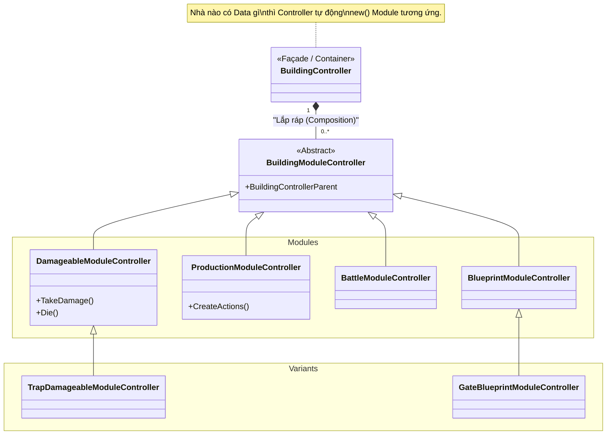

# Phân tích kiến trúc `Controller.Building.Module`

Thư mục `TheLastStand.Controller.Building.Module` chính là nơi **hiện thực hóa (implement) kiến trúc Component-based** mà chúng ta đã nhắc đến trong bài phân tích `BuildingController`. 

Nếu `BuildingController` là "Vỏ bọc" của tòa nhà, thì các `ModuleController` trong thư mục này chính là "Nội tạng" (Linh kiện) được lắp ráp vào bên trong vỏ bọc đó.

## 1. Thành phần cốt lõi: `BuildingModuleController`
Mọi module đều phải kế thừa từ lớp trừu tượng [`BuildingModuleController.cs`](file:///c:/Users/Admin/Desktop/ProjectGithub/TheLastSpell/TheLastStand.Controller.Building.Module/BuildingModuleController.cs). Lớp này có nhiệm vụ:
- Lưu giữ con trỏ `BuildingControllerParent` (để các module có thể nói chuyện ngược lại với vỏ bọc bên ngoài).
- Định nghĩa hàm `CreateModel()` để đúc ra phần Dữ liệu (Model) tương ứng.

## 2. Các "Linh kiện" cấu thành Công trình
Dưới đây là danh sách các mảnh ghép Module có thể được gắn vào một công trình. Cứ gắn mảnh ghép nào, công trình sẽ có chức năng của mảnh ghép đó:

| Tên Module | Chức năng đem lại cho Tòa nhà |
| :--- | :--- |
| `BlueprintModuleController` | **Bản vẽ gốc**: Module bắt buộc phải có. Nó quy định kích thước nhà (chiếm mấy ô), chi phí xây dựng, và category (là rào chắn hay mỏ vàng). |
| `ConstructionModuleController` | **Xây dựng**: Quản lý trạng thái "Đang xây" hay "Đã xây xong", thời gian/lượt cần để xây xong. |
| `DamageableModuleController` | **Máu & Giáp**: Biến một công trình vô hình thành một vật cản có thể bị quái vật đập. Nó xử lý logic nhận sát thương (TakeDamage), tính toán kháng phép/giáp, và cái chết (Die). |
| `ProductionModuleController` | **Sản xuất**: Quản lý các nút bấm hành động (`BuildingAction` - ví dụ: Xúc vàng) và các thanh tiến trình tự động (`BuildingGaugeEffect` - ví dụ: 2 lượt sinh 10 vàng). |
| `BattleModuleController` | **Chiến đấu**: Quản lý các mục tiêu (Goals) và kỹ năng để công trình tự động bắn quái (như Tháp tên, Máy bắn đá). |
| `PassivesModuleController` | **Bị động**: Nơi chứa và chạy hệ thống `BuildingPassive` (Các kỹ năng tự động nổ/buff). |
| `UpgradeModuleController` | **Nâng cấp**: Quản lý cây nâng cấp và liên kết với hệ thống `BuildingUpgrade`. |

### 2.1 Các Linh Kiện Đặc Biệt (Biến thể)
Để tránh làm code của các Module gốc bị phình to (if-else rườm rà), các Game Designer tạo ra các Module kế thừa (Override) cho các trường hợp đặc biệt:
- **Bẫy (Traps)**: Bẫy cũng là một dạng "nhà". Nhưng bẫy không nhận sát thương bình thường. Vì vậy nó dùng `TrapDamageableModuleController` thay vì `DamageableModuleController` để xử lý logic quái dẫm lên bẫy.
- **Brazier (Lửa trại)**: Có cơ chế dập tắt / bật sáng riêng, nên được thiết kế `BrazierModuleController` riêng biệt.
- **Cổng (Gate)**: Dùng `GateBlueprintModuleController` thay cho Blueprint thường để xử lý logic quái và người có thể đi xuyên qua tường thành.

## 3. Kiến trúc Component-Based Architecture (ECS-like)
Đây là cách thiết kế game hiện đại, trái ngược với OOP (Object-Oriented Programming) kế thừa truyền thống:

❌ **Cách cũ (Kế thừa)**: `Building` $\rightarrow$ `DefensiveBuilding` $\rightarrow$ `TowerBuilding`. Khi muốn tạo một cái `Tháp Tên` vừa bắn được, vừa sinh ra Vàng, bạn sẽ bị vướng mắc vì `TowerBuilding` không kế thừa từ `ProductionBuilding`.

✅ **Cách mới (Composition/Modules)**: Không có class `TowerBuilding`. Chỉ có Data File quy định: "Tháp Tên = `Blueprint` + `Damageable` + `Battle`".
- Muốn nó sinh ra Vàng? Thêm tag `Production` vào file Data. Hệ thống tự động đắp thêm `ProductionModuleController` vào Tháp Tên mà không cần viết thêm 1 dòng code C# nào!

## 4. Sơ đồ minh họa kiến trúc (Architecture Diagram)

