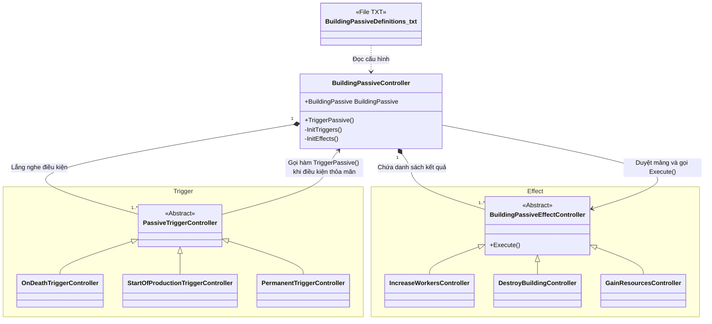

# Phân tích kiến trúc `Controller.Building.BuildingPassive`

Thư mục `TheLastStand.Controller.Building.BuildingPassive` điều khiển hệ thống **Kỹ năng bị động (Passives)** của các công trình. Đây là những hiệu ứng tự động chạy ngầm mà không cần thanh tiến trình (Gauge) hay nút bấm (Action).
Ví dụ: Tăng tối đa số lượng Công nhân khi xây nhà (Permanent), tự nổ chết khi hết đêm (After X Nights).

> **Data Driven (Hướng Dữ liệu)**
> Tương tự các thành phần khác, hệ thống Passive được cấu hình linh hoạt qua file Text.
> - File Data chính: [`BuildingPassiveDefinitions.txt`](file:///c:/Users/Admin/Desktop/ProjectGithub/TheLastSpell/TextAsset/BuildingPassiveDefinitions.txt)

## 1. Thành phần cốt lõi và Biến/Method

Kiến trúc của Passive được chia làm 2 nửa rõ rệt: **Trigger (Điều kiện kích hoạt)** và **Effect (Hiệu ứng xảy ra)**.

### 1.1 `BuildingPassiveController` (Bộ điều phối)
Lớp này nằm tại: [`BuildingPassiveController.cs`](file:///c:/Users/Admin/Desktop/ProjectGithub/TheLastSpell/TheLastStand.Controller.Building.BuildingPassive/BuildingPassiveController.cs). Nhiệm vụ của nó là cầu nối giữa Trigger và Effect.

**Các biến (Properties):**
- `BuildingPassive` (Model): Lưu trữ trạng thái của Passive, quan trọng nhất là danh sách các `PassiveTrigger` (chờ đợi khi nào thì nổ) và `PassiveEffect` (nổ ra cái gì).

**Các hàm (Methods):**
- `TriggerPassive()`: Gọi toàn bộ các `EffectController` bên trong nó chạy hiệu ứng.
- `IsTriggerValid()`: Kiểm tra xem điều kiện Trigger có hợp lệ không.
- Hàm Factory: Nhận dữ liệu cấu hình từ Definition và khởi tạo các class `TriggerController` và `EffectController` tương ứng.

### 1.2 `PassiveTrigger` (Khi nào thì kích hoạt?)
Thư mục `PassiveTrigger/` chứa các điều kiện "Cò súng". Mọi class kế thừa từ [`PassiveTriggerController.cs`](file:///c:/Users/Admin/Desktop/ProjectGithub/TheLastSpell/TheLastStand.Controller.Building.BuildingPassive.PassiveTrigger/PassiveTriggerController.cs).
- `StartOfProductionTriggerController`: Bóp cò vào mỗi rạng sáng.
- `OnDeathTriggerController`: Bóp cò khi công trình bị quái đập nát (Ví dụ: Bom tự sát).
- `OnConstructionTriggerController`: Bóp cò ngay khoảnh khắc đặt nhà xuống bản đồ.
- `PermanentTriggerController`: Luôn luôn có tác dụng vĩnh viễn (như tăng Worker).

### 1.3 `BuildingPassiveEffect` (Hiệu ứng là gì?)
Chứa các Controller lo việc thực thi khi cò súng đã bóp. Kế thừa từ [`BuildingPassiveEffectController.cs`](file:///c:/Users/Admin/Desktop/ProjectGithub/TheLastSpell/TheLastStand.Controller.Building.BuildingPassive/BuildingPassiveEffectController.cs).
- `IncreaseWorkersController`: Cộng thêm giới hạn Công nhân (Worker) cho người chơi.
- `GainResourcesController`: Cho tiền Vàng/Vật liệu.
- `DestroyBuildingController`: Tự hủy tòa nhà (Thường kết hợp với Trigger `AfterXNightTurns` để làm các bức tường tạm thời tự sập).
- `UpdateShopLevelController`: Nâng cấp bậc (Tier) đồ bán trong Shop.

## 2. Design Pattern & Kiến trúc sử dụng
- **Observer / Listener Pattern**: Các `TriggerController` thường sẽ đăng ký lắng nghe (subscribe) các sự kiện toàn cục của Game. Ví dụ, `OnDeathTrigger` sẽ lắng nghe sự kiện chết của `DamageableModule`. Khi sự kiện xảy ra, nó sẽ gọi `BuildingPassiveController.TriggerPassive()`.
- **Strategy Pattern (kết hợp Composition)**: Việc tách Passive ra làm 2 phần (Trigger và Effect) là một thiết kế cực kỳ thông minh. Bạn có thể ghép *BẤT KỲ* Trigger nào với *BẤT KỲ* Effect nào thông qua Data.
  - *Ví dụ 1*: `OnDeathTrigger` + `GainResources` = Nhà bị phá thì rớt lại chút vàng an ủi.
  - *Ví dụ 2*: `StartOfProductionTrigger` + `GainResources` = Mỗi sáng ngủ dậy nhận 50 vàng (Tương tự như mỏ vàng).

## 3. Sơ đồ minh họa kiến trúc (Architecture Diagram)

