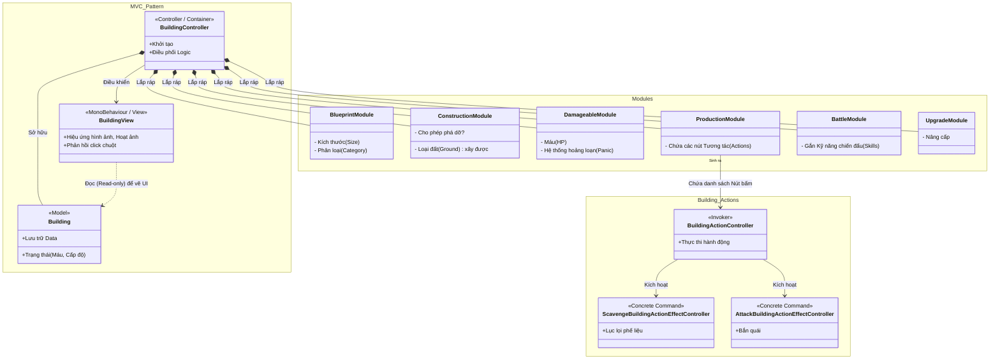

# Báo cáo Tổng hợp Hệ thống Công trình (Building System) - The Last Stand

Tài liệu này tổng hợp toàn bộ quy trình hoạt động, cấu trúc mã nguồn, và kiến trúc thiết kế của hệ thống **Công trình (Building)** trong game. Hệ thống này là một ví dụ mẫu mực về cách áp dụng **Module Pattern** (hay còn gọi là Entity-Component) kết hợp với **Command Pattern** để quản lý độ phức tạp trong lập trình game.

---

## 1. Tổng quan Hệ thống (Overview)

Trong The Last Stand, "Công trình" (Building) không chỉ là những bức tường hay tháp canh, mà nó còn có thể là Phế tích (Ruins) để lục lọi, Mỏ vàng, hay Vòng tròn ma thuật (Magic Circle). Vì tính đa dạng cực cao này, hệ thống không sử dụng tính Kế thừa truyền thống (Inheritance) mà sử dụng tính **Lắp ráp (Composition)**.

**Đặc điểm nổi bật:**
*   **Không code chết (No Hardcoding):** Thông số, chức năng, nút bấm của mọi công trình đều được cấu hình trong file XML (`BuildingDefinitions.txt`).
*   **Chia để trị (Decoupling):** Một tòa nhà được chia nhỏ thành nhiều Module. Tòa nhà nào cần tính năng gì thì "lắp" Module đó vào.

---

## 2. Sơ đồ Kiến trúc Toàn cảnh (Architecture Diagram)

Sơ đồ dưới đây minh họa cách một tòa nhà được lắp ráp từ các Module và cách nó giao tiếp với Hệ thống View (Giao diện) cũng như Hệ thống Action (Hành động).

---

## 3. Phân tích Chi tiết Từng Design Pattern

### A. MVC (Model - View - Controller) Tách biệt hoàn toàn
Hệ thống Building phân chia trách nhiệm cực kỳ rõ ràng:
*   **Model (`TheLastStand.Model.Building`):** Nơi thuần túy lưu trữ dữ liệu (ví dụ: Máu hiện tại là bao nhiêu). Không có bất kỳ dòng code Unity nào (không dùng `Vector3`, không kế thừa `MonoBehaviour`).
*   **View (`TheLastStand.View.Building.BuildingView.cs`):** File này là `MonoBehaviour` (được gắn lên Prefab trong Unity). Nó **chỉ làm nhiệm vụ hiển thị**. Nó sẽ "lắng nghe" (Observer) sự thay đổi từ Model (như máu bị tụt) để cập nhật thanh máu đỏ, phát hạt bụi (Particle Effect) hay đổi Sprite (vỡ nát). Nó tuyệt đối không chứa logic game.
*   **Controller (`BuildingController.cs`):** Đứng giữa làm trung gian. Nó tiếp nhận cú click chuột từ View, chạy Logic, tính toán xong xuôi thì cập nhật Model. Sau đó View sẽ tự động cập nhật hình ảnh.

### B. Module Pattern (Entity-Component System nhúng)
Sự kỳ diệu nằm ở chỗ: Thay vì tạo ra class `DefensiveBuilding` kế thừa từ `Building`, rồi lại `GoldMineBuilding` kế thừa từ `Building` (điều sẽ dẫn đến cấu trúc phình to không kiểm soát), các Dev đã dùng **Module Pattern**.
Class `BuildingController` thực chất chỉ là một **cái vỏ (Container)**. Nó sở hữu một đống Modules (như sơ đồ trên).
*   Nếu là Cột mốc (Tháp cắm đuốc), nó chỉ có `BlueprintModule`.
*   Nếu là Tháp cung, nó được gắn thêm `DamageableModule` (có máu) và `BattleModule` (có khả năng bắn).
*   Cách thiết kế này giúp tận dụng lại 100% code (Re-usability) và cực kỳ linh hoạt!

### C. Command Pattern (`TheLastStand.Controller.Building.BuildingAction`)
Khi người chơi bấm vào một tòa nhà, một danh sách các "Nút hành động" sẽ hiện lên. Hệ thống xử lý các nút này nằm ở Module `ProductionModule` và namespace `BuildingAction`.
*   **Tách biệt hành động:** Mỗi một nút bấm (Ví dụ: Nút *Scavenge* (Lục lọi), Nút *Recruit* (Thuê tướng)) không được viết chung vào `BuildingController`.
*   Thay vào đó, mỗi hành động được bọc vào một Class Command riêng lẻ (Ví dụ `ScavengeBuildingActionEffectController`).
*   `BuildingActionController` đóng vai trò là Invoker (Người bấm nút). Khi người chơi click, nó chỉ cần gọi hàm `Execute()` của Command tương ứng. Pattern này giúp hệ thống dễ dàng có thêm tính năng Undo (Hoàn tác) hay ghi lại lịch sử thao tác của người chơi.

## 4. Dòng chảy Dữ liệu (Data Flow)
Cũng giống như hệ thống Apocalypse, hệ thống Building được nạp dữ liệu từ file XML bằng công cụ bạn vừa dùng thử.
1.  **Definitions:** File `BuildingDefinitions.txt` chứa cấu trúc của tòa nhà (Máu, Size, ID các nút bấm). File `BuildingActionDefinitions.txt` chứa chi tiết về nút bấm (Giá tiền, Số lần bấm).
2.  **Khởi tạo:** Khi người chơi bắt đầu màn, `BuildingDatabase` đọc XML và lưu vào các `Definition`.
3.  **Lắp ráp:** Khi người chơi đặt một tòa nhà xuống đất, `BuildingController` được sinh ra. Nó đọc `BuildingDefinition`, thấy có thẻ `<Damageable>`, nó lập tức `new DamageableModuleController()`. Thấy thẻ `<Production>`, nó sinh ra `ProductionModule` chứa các Nút lệnh.

---

> [!TIP]
> **Kết luận:**
> Nếu kiến trúc Apocalypse thiên về **Observer (Lắng nghe sự kiện)** để không cản trở luồng game, thì kiến trúc Building lại là cuốn sách giáo khoa về **Composition over Inheritance (Ưu tiên Lắp ráp hơn Kế thừa)**. Cách thiết kế này cho phép đội ngũ thiết kế màn chơi (Game Designer) tự do sáng tạo ra hàng trăm loại công trình với các chức năng điên rồ nhất mà Lập trình viên không cần phải viết thêm một dòng code nào mới!
