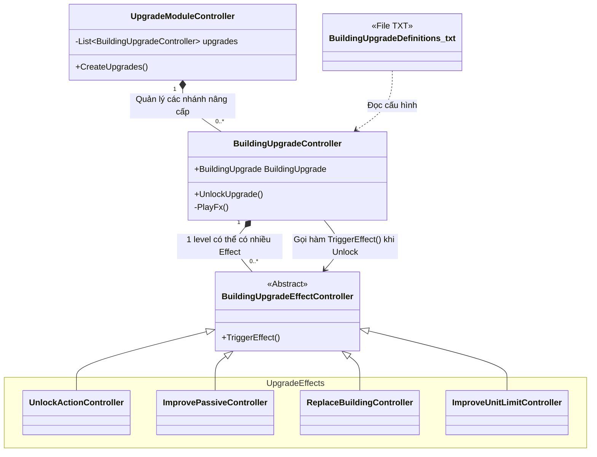

# Phân tích kiến trúc `Controller.Building.BuildingUpgrade`

Thư mục `TheLastStand.Controller.Building.BuildingUpgrade` quản lý toàn bộ hệ thống **Nâng cấp (Upgrade)** của các công trình trong game. Khi bạn bấm vào một tòa nhà và bỏ vàng/vật liệu để nâng cấp nó (như tăng máu, mở khóa skill mới, tăng số lượng đồ bán trong shop), mọi logic đó sẽ chạy qua đây.

> **Data Driven (Hướng Dữ liệu)**
> Tương tự các hệ thống khác, hệ thống Nâng cấp được cấu hình thông qua các file Text:
> - File cấu hình nâng cấp: [`BuildingUpgradeDefinitions.txt`](file:///c:/Users/Admin/Desktop/ProjectGithub/TheLastSpell/TextAsset/BuildingUpgradeDefinitions.txt)
> - Cấu hình nâng cấp vĩnh viễn (Global/Meta): [`MetaUpgradeDefinitions_Buildings.txt`](file:///c:/Users/Admin/Desktop/ProjectGithub/TheLastSpell/TextAsset/MetaUpgradeDefinitions_Buildings.txt)

## 1. Thành phần cốt lõi và Biến/Method

### 1.1 `BuildingUpgradeController` (Trình quản lý nâng cấp)
Đây là lớp gốc điều phối 1 chuỗi nâng cấp của công trình. Nằm tại [`BuildingUpgradeController.cs`](file:///c:/Users/Admin/Desktop/ProjectGithub/TheLastSpell/TheLastStand.Controller.Building.BuildingUpgrade/BuildingUpgradeController.cs).

**Các biến (Properties):**
- `BuildingUpgrade` (Model): Chứa dữ liệu về cấp độ nâng cấp hiện tại (`UpgradeLevel`) và danh sách các bậc nâng cấp (Leveled Upgrades).

**Các hàm (Methods):**
- `UnlockUpgrade(freeUpgrade, playFx, sendAnalytics)`: Đây là hàm quan trọng nhất. Khi người chơi ấn nút "Upgrade":
  1. **Kiểm tra**: Xem người chơi có đủ Vàng (Gold) và Vật liệu (Materials) không.
  2. **Thực thi**: Tăng `UpgradeLevel` lên 1 và trừ tài nguyên.
  3. **Kích hoạt hiệu ứng**: Duyệt qua danh sách các `BuildingUpgradeEffectController` (của level vừa lên) và gọi hàm `TriggerEffect()` của chúng.
  4. **Hiển thị**: Gọi hàm `PlayFx()` để phát hiệu ứng hình ảnh (CastFx) báo hiệu nâng cấp thành công.

### 1.2 `BuildingGlobalUpgradeController`
Giống như `BuildingUpgradeController`, nhưng chuyên dùng cho các nâng cấp vĩnh viễn (Unlock từ Meta/Oraculum). Khi bạn nâng cấp ở ngoài sảnh chính, tất cả các công trình xây trong màn chơi sẽ tự động nhận được các Effect này. Nằm tại [`BuildingGlobalUpgradeController.cs`](file:///c:/Users/Admin/Desktop/ProjectGithub/TheLastSpell/TheLastStand.Controller.Building.BuildingUpgrade/BuildingGlobalUpgradeController.cs).

### 1.3 `BuildingUpgradeEffect` (Các hiệu ứng khi nâng cấp)
Thư mục này chứa hàng loạt các Controller kế thừa từ [`BuildingUpgradeEffectController.cs`](file:///c:/Users/Admin/Desktop/ProjectGithub/TheLastSpell/TheLastStand.Controller.Building.BuildingUpgrade/BuildingUpgradeEffectController.cs). Mỗi class là một mảnh ghép đại diện cho phần thưởng bạn nhận được khi nâng cấp:
- `UnlockActionController`: Mở khóa một nút chức năng mới cho nhà (Ví dụ lúc đầu chưa có, nâng cấp xong mới có nút Sinh vàng).
- `ImprovePassiveController`: Tăng sức mạnh cho các kỹ năng bị động (Passive) hiện có.
- `ImproveGaugeEffectController`: Tăng chỉ số cho thanh tiến trình (Ví dụ từ 10 vàng/đêm lên 20 vàng/đêm).
- `ImproveUnitLimitController`: Tăng giới hạn số lượng Hero hoặc Worker.
- `ReplaceBuildingController`: Cực kỳ thú vị! Cho phép thay thế thẳng tòa nhà hiện tại bằng một tòa nhà cấp cao hơn (Đổi Model/Sprite hoàn toàn).
- `SwapSkillController` / `SwapActionController`: Tráo đổi bộ kỹ năng của tòa nhà.

## 2. Design Pattern & Kiến trúc
- **Factory Pattern**: Tương tự các hệ thống trước, các `EffectController` được đúc ra từ dữ liệu cấu hình thông qua Factory.
- **Composite Pattern**: Việc nâng cấp 1 level có thể mang lại *rất nhiều lợi ích cùng lúc* (vừa tăng máu, vừa mở skill mới). Game làm điều này bằng cách gán 1 list (danh sách) các `BuildingUpgradeEffectController` vào 1 Level nâng cấp. Hàm `UnlockUpgrade()` chỉ việc chạy vòng lặp kích hoạt hết mảng đó.
- **Command Pattern (biến thể)**: Việc tách các hiệu ứng nâng cấp thành các file nhỏ (`ImproveLevel`, `ReplaceBuilding`,...) giúp code cực kỳ sạch (Clean Code / SOLID). Không có những câu lệnh if-else dài ngoằng để kiểm tra "nhà này nâng cấp thì được cái gì".

## 3. Sơ đồ minh họa kiến trúc (Architecture Diagram)

