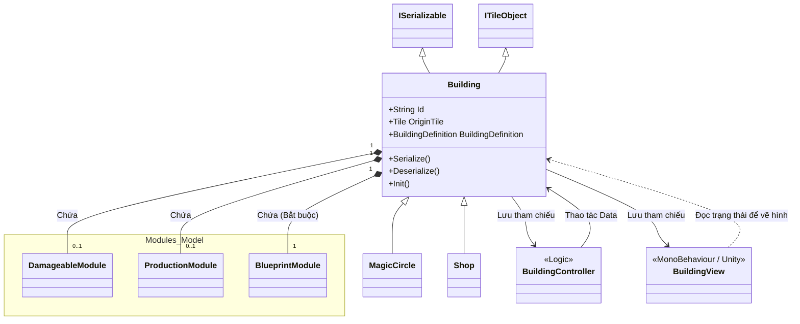

# Phân tích thư mục `TheLastStand.Model.Building`

Chúng ta đang đi sâu vào tầng **Model** của mô hình kiến trúc MVC trong game. Thư mục này chịu trách nhiệm lưu trữ **Trạng thái (State) và Dữ liệu** của một công trình. 

Nếu *Controller* là "bộ não" suy nghĩ logic, *View* là "lớp da" hiển thị hình ảnh, thì *Model* ở đây chính là "hồ sơ bệnh án" lưu lại mọi thông tin của công trình đó (Nó là nhà gì? Còn bao nhiêu máu? Nằm ở ô nào trên bản đồ?).

## 1. Thành phần cốt lõi: `Building.cs`
File quan trọng nhất trong thư mục này là [`Building.cs`](file:///c:/Users/Admin/Desktop/ProjectGithub/TheLastSpell/TheLastStand.Model.Building/Building.cs). Hãy xem xét các đặc điểm thiết kế cực kỳ chuẩn mực của nó:

### 1.1 Tính độc lập (Pure C#)
`Building` là một class C# thuần túy. Nó **không kế thừa** `MonoBehaviour` của Unity. Điều này có nghĩa là bạn có thể dễ dàng Unit Test, lưu trữ (Save/Load) và truyền tải dữ liệu của nó mà không bị vướng bận vào Unity Engine. 

Nó chỉ Interface với các hệ thống ngoài bằng: `ISerializable` (hỗ trợ Save), `IDeserializable` (hỗ trợ Load), `ITileObject` (để đặt lên lưới map).

### 1.2 Mối quan hệ MVC trong Code
Trong constructor của mình, `Building` lưu giữ tham chiếu tới cả `BuildingController` và `BuildingView`.
Mọi tương tác như "Trừ máu" hay "Bấm nút nâng cấp" đều được gọi thông qua Controller. Sau đó Controller sẽ sửa đổi các biến bên trong Model này.

### 1.3 Nơi "Lắp ráp" Modules
Đúng như kiến trúc Component-based mà chúng ta đã phân tích ở bài trước. File Model này chứa trực tiếp các "ổ cắm" cho các linh kiện nội tạng:
```csharp
public BattleModule BattleModule { get; private set; }
public BlueprintModule BlueprintModule { get; private set; }
public ConstructionModule ConstructionModule { get; private set; }
public DamageableModule DamageableModule { get; private set; }
public PassivesModule PassivesModule { get; private set; }
public ProductionModule ProductionModule { get; private set; }
public UpgradeModule UpgradeModule { get; private set; }
```
Khi game load, hàm `CreateModules()` sẽ đọc file Data. Nếu Data nói nhà này có máu $\rightarrow$ Gắn `DamageableModule` vào; không có máu $\rightarrow$ Bỏ trống (null).

### 1.4 Các "Lối tắt" (Helper Properties)
Class cung cấp hàng chục hàm Get nhanh cực kỳ tiện lợi để hỏi xem tòa nhà này thuộc loại gì, bằng cách tra cứu thẳng vào `BlueprintModuleDefinition.Category`. Ví dụ:
- `IsBarricade` (Có phải rào chắn cản đường không?)
- `IsTrap` (Có phải bẫy không?)
- `IsTurret` (Có phải chòi canh không?)
Nhờ vậy, Controller bên ngoài khi cần check logic sẽ không phải viết các câu lệnh phức tạp.

## 2. Lưu và Tải Game (Serialization)
Một trách nhiệm quan trọng của Model là Save/Load. Trong `Building.cs` có 2 hàm `Serialize()` và `Deserialize()`. 
Cách nó hoạt động rất đồng bộ:
1. `Serialize()` tạo một object tên là `SerializedBuilding`. Nó ném các thông tin cơ bản vào đó (ID, Tọa độ).
2. Sau đó nó bảo: "Này các Module đang cắm trên người tao, tự lưu dữ liệu của tụi mày vào cục `SerializedBuilding` này đi!".
3. Các module sẽ lần lượt lưu (Máu còn bao nhiêu, Upgrade cấp mấy) vào cục Data đó để ghi ra ổ cứng.

## 3. Các Model Biến thể (Variants)
Ngoài `Building.cs`, thư mục này còn chứa các file Model đặc biệt:
- `MagicCircle.cs`: Đây chính là cái Vòng tròn ma thuật ở giữa bản đồ mà bạn phải bảo vệ bằng mọi giá. Nó kế thừa từ `Building` nhưng có thêm các thông số đặc biệt để xử lý màn thua (Game Over).
- `Shop.cs`: Model lưu trữ các dữ liệu riêng của cửa hàng (Danh sách đồ đang bán, phí reroll).
- `Construction.cs`: Đại diện cho một tòa nhà "đang được xây dở dang" ban ngày.
- `BuildingToRestore.cs`: Lưu trạng thái của những Tàn tích (Ruins) trên bản đồ chờ người chơi vác công nhân tới dọn dẹp hoặc sửa chữa.

## 4. Sơ đồ minh họa kiến trúc (Architecture Diagram)

