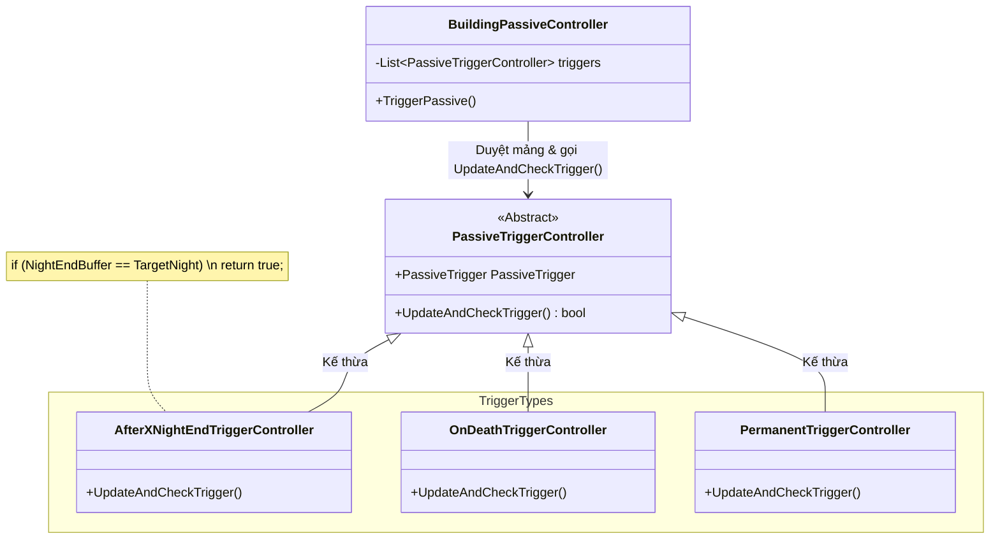

# Phân tích thư mục `Controller.Building.BuildingPassive.PassiveTrigger`

Thư mục này là một phần (nửa đầu) của hệ thống **Kỹ năng bị động (Passive)**. Trong khi `PassiveEffect` quy định "chuyện gì sẽ xảy ra" (như nổ, sinh vàng, sập nhà), thì thư mục `PassiveTrigger` này quy định **"khi nào thì nó xảy ra"** (hay còn gọi là **Cò súng**).

## 1. Thành phần cốt lõi và Biến/Method

### 1.1 Lớp trừu tượng gốc: `PassiveTriggerController`
Mọi Trigger đều bắt buộc phải kế thừa từ lớp cha [`PassiveTriggerController.cs`](file:///c:/Users/Admin/Desktop/ProjectGithub/TheLastSpell/TheLastStand.Controller.Building.BuildingPassive.PassiveTrigger/PassiveTriggerController.cs). Lớp này định nghĩa phương thức nền tảng để kiểm tra điều kiện.

**Các hàm (Methods) cốt lõi:**
- `UpdateAndCheckTrigger(bool onLoad)`: Đây là hàm quan trọng nhất. Mỗi khi một sự kiện cụ thể trong game diễn ra (ví dụ: Chuyển sang ngày mới), hệ thống sẽ gọi hàm này. Hàm sẽ trả về `true` (Nổ / Bóp cò) hoặc `false` (Chưa thỏa mãn điều kiện).

### 1.2 Các class con (Ví dụ: `AfterXNightEndTriggerController`)
Hãy nhìn vào class [`AfterXNightEndTriggerController.cs`](file:///c:/Users/Admin/Desktop/ProjectGithub/TheLastSpell/TheLastStand.Controller.Building.BuildingPassive.PassiveTrigger/AfterXNightEndTriggerController.cs) mà bạn vừa mở để hiểu cách nó hoạt động. Trigger này có nghĩa là "Sau X đêm thì nổ".

**Các biến (Properties):**
- `AfterXNightEndTrigger` (Model): Chứa dữ liệu của Trigger, bao gồm bộ đếm `NightEndBuffer` (đã qua bao nhiêu đêm) và cấu hình `NumberOfNightEnd` (cần qua bao nhiêu đêm thì kích hoạt).

**Hàm `UpdateAndCheckTrigger()` hoạt động như sau:**
```csharp
public override bool UpdateAndCheckTrigger(bool onLoad)
{
    // Mỗi lần được gọi (tức là khi hết 1 đêm), cộng dồn bộ đếm lên 1.
    AfterXNightEndTrigger.NightEndBuffer++;
    
    // Nếu bộ đếm bằng đúng với số đêm quy định trong Data -> Bóp Cò (return true)
    return AfterXNightEndTrigger.NightEndBuffer == AfterXNightEndTrigger.AfterXNightEndTriggerDefinition.NumberOfNightEnd;
}
```

### 1.3 Các Trigger Controllers Khác
Thư mục này chứa nhiều loại "cò súng" khác nhau tùy theo thiết kế game:
- **Thời gian / Theo lượt:**
  - `AfterXNightTurnsTriggerController`: Kích hoạt sau X lượt đánh trong đêm.
  - `AfterXProductionPhasesTriggerController`: Kích hoạt sau X pha sản xuất (ban ngày).
  - `StartOfProductionTriggerController`: Kích hoạt mỗi khi bình minh lên.
  - `StartOfNightEnemyTurnTriggerController`: Kích hoạt khi quái bắt đầu đi.
- **Sự kiện (Event-driven):**
  - `OnDeathTriggerController`: Kích hoạt khi công trình này bị quái phá hủy hết máu.
  - `OnConstructionTriggerController`: Kích hoạt 1 lần duy nhất ngay lúc vừa đặt nhà xuống xây.
  - `OnExtinguishTriggerController`: Kích hoạt khi ngọn lửa / ánh sáng của nhà bị dập tắt (như Brazier).
- **Trạng thái:**
  - `PermanentTriggerController`: Trạng thái "luôn luôn đúng", không cần điều kiện (Thường dùng để cộng chỉ số vĩnh viễn cho Hero/Building chừng nào nhà còn tồn tại).

## 2. Design Pattern & Kiến trúc
- **Strategy Pattern**: Mỗi loại Trigger là một chiến lược kiểm tra điều kiện riêng biệt. `BuildingPassiveController` (class quản lý) không cần biết chi tiết Trigger bên trong là gì, nó chỉ gọi `UpdateAndCheckTrigger()` và đợi kết quả `true` hay `false`. Điều này giúp hệ thống dễ dàng mở rộng thêm các Trigger mới mà không sợ hỏng code cũ.
- **State / Counter (Bộ đếm trạng thái)**: Như trong `AfterXNightEnd`, Controller không chỉ kiểm tra điều kiện (Check) mà còn chịu trách nhiệm cập nhật trạng thái của Model (Update) thông qua biến `NightEndBuffer++`. Nhờ đó, game có thể lưu lại tiến trình (Save Game) và tiếp tục đếm khi người chơi tải lại game.

## 3. Sơ đồ minh họa (Architecture Diagram)

