# Phân tích thư mục `TheLastStand.View.Building`

Chào mừng đến với tầng cuối cùng trong mô hình MVC: **View (Hiển thị)**.
Nếu `Model` chứa những con số khô khan, `Controller` chứa các phép toán logic, thì thư mục `TheLastStand.View.Building` chính là nơi khoác lên một lớp áo đồ họa tuyệt đẹp cho công trình. Nó phụ trách tất cả những gì mắt bạn có thể nhìn thấy và tai bạn có thể nghe thấy trên màn hình Unity.

## 1. Thành phần cốt lõi: `BuildingView.cs`
Lớp [`BuildingView.cs`](file:///c:/Users/Admin/Desktop/ProjectGithub/TheLastSpell/TheLastStand.View.Building/BuildingView.cs) kế thừa `MonoBehaviour`, được gắn trực tiếp lên GameObject trong Unity.

### 1.1 Các biến (Properties & Fields) quan trọng:
- `BuildingHUD hudPrefab`: Tham chiếu đến Prefab chứa thanh máu và icon phía trên tòa nhà.
- `ParticleSystem smokeSystem` & `GameObject damagedParticles`: Các hệ thống hạt (Particles) phun ra khói hoặc mảnh vỡ khi nhà bị đánh.
- `DamagedBuildingFlameView[] flameViews`: Mảng chứa các hiệu ứng ngọn lửa nhỏ để gắn lên nhà khi máu tụt xuống thấp.
- `SkillTargetingMark skillTargetingMark`: Biểu tượng hiển thị dưới chân nhà khi nó đang được nhắm mục tiêu (bởi quái hoặc kỹ năng).
- `BuildingController buildingController`: Móc nối (Link) ngược lại với bộ não Controller để lấy dữ liệu.

### 1.2 Các hàm (Methods) điều khiển đồ họa:
- `InitVisuals()`: Khởi tạo tất cả các cục Feedback hình ảnh (ví dụ: `AttackFeedback` để nhảy số sát thương). Nó cũng gọi hàm bật lửa cháy nếu máu nhà hiện đang thấp.
- `Hovered` / `Selected` (Properties có logic setter): Khi rê chuột hoặc click vào, nó gọi `RefreshCursorFeedback()` để vẽ viền sáng (Outline) quanh nhà, và gọi `DisplaySkillRangeIfNeeded()` để hiển thị lưới tầm bắn (nếu là tháp canh).
- `ToggleBuildingFlamesOnDamagedThreshold()`: Hàm này kiểm tra máu trong Model. Nếu máu < Ngưỡng cháy (DamagedThreshold), nó lôi các `DamagedBuildingFlameView` từ trong Pool ra và gắn rải rác xung quanh thân nhà.
- `PlayTakeDamageAnim()` & `PlayDieAnimCoroutine()`: Xử lý hoạt ảnh bị đánh và chết. Đặc biệt hàm chết sử dụng `Coroutine` để chờ khói bốc lên xong xuôi rồi mới đổi Sprite nhà thành đống tàn tích.

## 2. Lớp biến thể đặc biệt: `MagicCircleView.cs`
Bạn vừa mở file [`MagicCircleView.cs`](file:///c:/Users/Admin/Desktop/ProjectGithub/TheLastSpell/TheLastStand.View.Building/MagicCircleView.cs). Vòng tròn ma thuật là trái tim của game, vì vậy đồ họa của nó phức tạp và mang tính chất "kết thúc game" (Game Over). Nó kế thừa từ `BuildingView` và ghi đè (override) nhiều logic.

### 2.1 Các biến và hàm quan trọng trong `MagicCircleView`:
- **Hàm `InitAnimations()`**: Không dùng Animation cố định! Nó lấy ID của Thành phố hiện tại (`SelectedCity.CityDefinition.Id`), sau đó vào thư mục gốc lôi ra đúng đoạn Animation (`Idle`, `Hit`, `Destruction`) của riêng thành phố đó và nạp vào `AnimatorOverrideController`. Nghĩa là Vòng tròn ma thuật ở Map 1 sẽ có Animation khác Map 2.
- **Hàm `PlayDieAnim()` (Override)**: Khi cái vòng này vỡ, game kết thúc. Thay vì chỉ sập nhà như bình thường, hàm này làm các việc cực kỳ hệ trọng:
  1. `SettingsController.ToggleGameSpeed(false)`: Dừng toàn bộ tốc độ game lại (Slow motion / Đóng băng).
  2. `SoundManager.Instance.StopMusic()`: Tắt ngay lập tức nhạc nền để tạo sự im lặng căng thẳng.
  3. `LightningSDKManager.Instance.TransitionToColor(Color.black)`: Từ từ chìm màn hình vào màu đen để chuẩn bị hiện màn hình Game Over.
- **Hàm `NextDestructionStage()`**: Vòng tròn ma thuật không chết ngay trong 1 hit, nó có nhiều mốc vỡ (Stages). Hàm này kích hoạt từng mảng đồ họa vỡ ra theo từng mốc.

## 3. Tổng kết quy trình hoạt động (Luồng chạy của MVC)
Dưới đây là sơ đồ tổng kết luồng đi của một sự kiện trong MVC: **Khi quái vật cắn một tòa nhà**.

```mermaid
sequenceDiagram
    participant Quái vật
    participant Controller (Bộ não)
    participant Model (Dữ liệu)
    participant View (Màn hình Unity)

    Quái vật->>Controller: Cắn cái nhà 50 sát thương!
    Controller->>Model: Kiểm tra giáp. Trừ máu đi 50 nhé!
    Model-->>Controller: (Lưu dữ liệu mới) Máu hiện tại chỉ còn 30%.
    Controller->>View: Báo động! Nhà sắp sập rồi, cập nhật hình ảnh đi!
    
    rect rgb(40, 40, 40)
        Note over View: Tầng View bắt đầu xử lý hình ảnh (BuildingView)
        View->>View: Trừ thanh máu đỏ tụt xuống 30% trên HUD.
        View->>View: Bật hiệu ứng lửa cháy rực (ToggleBuildingFlames).
        View->>View: Hiện con số -50 nảy lên (AttackFeedback).
    end
```

